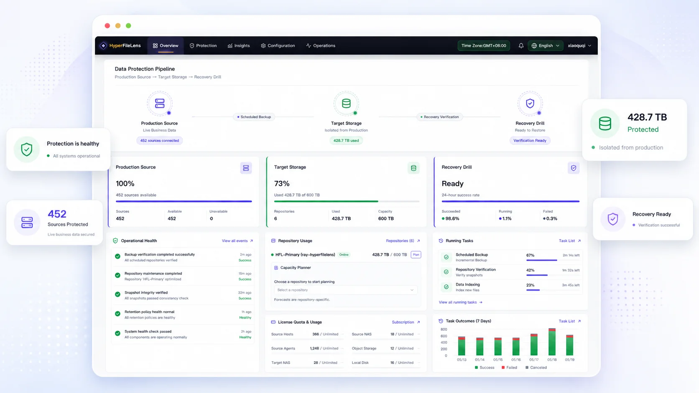
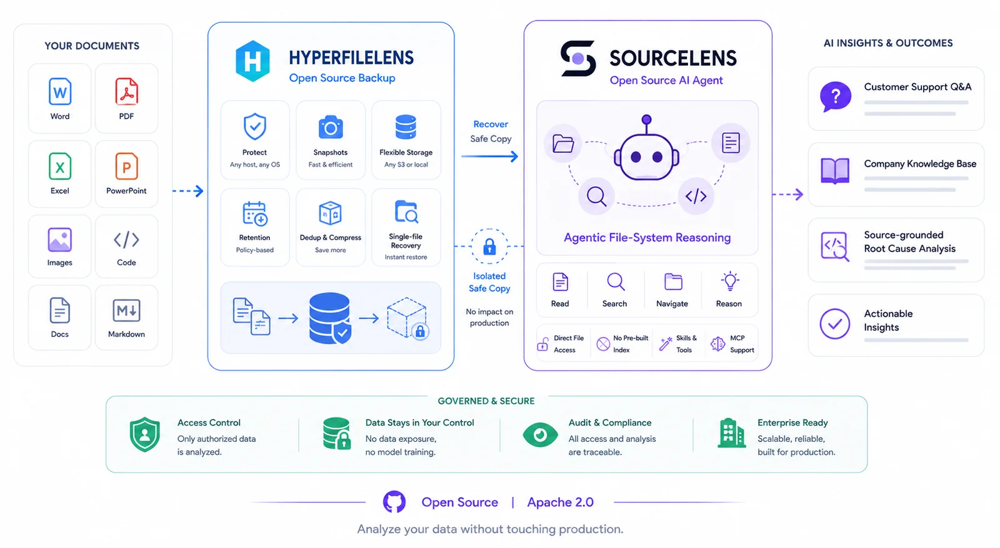
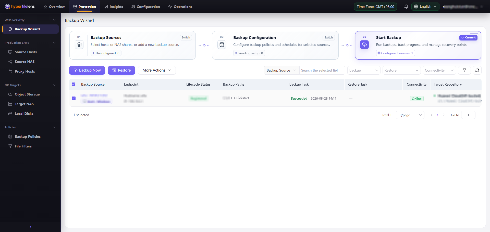
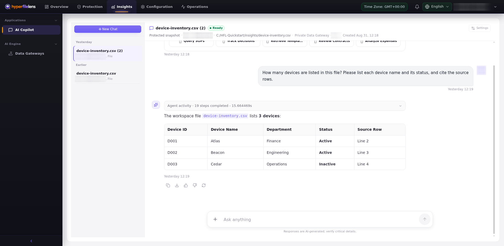

<div align="center">

<picture>
  <source media="(prefers-color-scheme: dark)" srcset="website/public/brand/source/hyperfilelens-lockup-on-dark.png">
  
</picture>

English | [中文](README.zh-CN.md)

**Your backups know more than you think.**

Open-source backup and recovery with AI-powered Insights from protected snapshots.

[Website](https://hyperfilelens.com/en/) · [Documentation](https://hyperfilelens.com/en/docs/) · [Try Free](https://app.hyperfilelens.com/) · [Releases](https://github.com/oneprolabs/hyperfilelens/releases)

</div>

HyperFileLens protects files on Windows, Linux, and macOS hosts as isolated point-in-time snapshots. Browse and restore files when needed, or use snapshots as the data source for AI-powered Insights without giving AI direct access to production files.

<p align="center">
  
</p>

## From Backup to Insights

HyperFileLens connects backup, recovery, and Insights through the same backup snapshot. A backup job writes selected files to target storage and creates a point-in-time snapshot. That snapshot can then be browsed and restored, or selected as the data source for an Insights session.

<p align="center">
  
</p>

Insights only works with data selected from a specific snapshot. It does not read live files from the protected host.

## Core Workflows

### Create a Backup

Connect a backup host and target storage, select the files or folders to protect, and create a browsable point-in-time snapshot.

- Protect local files on Windows, Linux, and macOS hosts.
- Use object storage, NAS, or local storage connected through a Proxy.
- Run a backup on demand, or schedule recurring backups with policies and retention rules.

### Restore Files and Folders

Browse a selected snapshot and restore files or folders to their original location or another available location. A restore test helps verify the data and recovery workflow you rely on.

### Get Insights from Snapshots

Select files or folders from an existing backup snapshot and use Insights to find, summarize, and analyze their content. Each session is limited to the selected snapshot and data scope, with a Data Gateway providing access to that data.

## Why HyperFileLens

- **Backup, recovery, and Insights in one workflow**: Use the same backup snapshot for restoring data and understanding its contents.
- **Insights from isolated snapshots**: Analyze a selected protected copy instead of live files on a production host.
- **Flexible ways to run it**: Use the official SaaS or deploy Community in an environment you manage.

## See HyperFileLens in Action

After a backup completes, HyperFileLens creates a browsable and restorable point-in-time snapshot.

<p align="center">
  
</p>

Insights answers questions using the snapshot data selected for the session and shows the related sources.

<p align="center">
  
</p>

## Get Started

### Use the Official SaaS

The official HyperFileLens SaaS is provided and operated by OnePro Cloud. There is no control plane to install or maintain.

- Visit the [HyperFileLens product website](https://hyperfilelens.com/en/) to learn more.
- Open the [SaaS console](https://app.hyperfilelens.com/) to start using the product.
- Follow the [first-use guide](https://hyperfilelens.com/en/docs/) to complete your first backup, restore, and Insights workflow.

When using SaaS, install an Agent on the host whose files you want to protect and prepare object storage that both the SaaS and the backup host can reach.

### Install Community

Community runs on an Ubuntu host that you manage. The installation host must meet these basic requirements:

- Ubuntu 20.04, 22.04, or 24.04 on amd64.
- At least 2 CPU cores, 4 GiB of memory, and 20 GiB of free space on the disk containing `/opt`.
- Docker Engine 24.0.0 or later and Docker Compose V2 2.20.0 or later, installed and running.
- `curl`, `sudo` access, and network access to GitHub, the container registry, and the Ubuntu package repositories.

Run the following command on the prepared host:

```bash
curl -fsSL https://raw.githubusercontent.com/oneprolabs/hyperfilelens/main/deploy/online/install.sh \
  | sudo bash -s -- --mirror global
```

When installation finishes, find the complete address marked `Tenant` in the installation result and open it in a browser to enter the HyperFileLens console.

See [Install Community](https://hyperfilelens.com/en/docs/getting-started/install) for detailed system requirements, network conditions, and installation checks.

## Complete Your First Workflow

Follow the first-use guide with a set of test files to walk through the complete path from data access to backup, restore, and Insights:

1. [Sign in to the console](https://hyperfilelens.com/en/docs/getting-started/sign-in).
2. [Add a backup source](https://hyperfilelens.com/en/docs/getting-started/add-source) and install the Agent on the backup host.
3. [Configure the backup source](https://hyperfilelens.com/en/docs/getting-started/configure-source) and select the files or folders to protect.
4. [Add target storage](https://hyperfilelens.com/en/docs/getting-started/add-target).
5. [Create and run the first backup](https://hyperfilelens.com/en/docs/getting-started/first-backup).
6. [Check the job and snapshot](https://hyperfilelens.com/en/docs/getting-started/verify-backup).
7. [Restore a test file](https://hyperfilelens.com/en/docs/getting-started/first-restore).
8. [Create an Insights session](https://hyperfilelens.com/en/docs/getting-started/first-insight).

## How the Product Works

| Component | Product responsibility |
| --- | --- |
| HyperFileLens console | Manage backup sources, target storage, backup configurations, jobs, snapshots, restores, and Insights |
| Agent | Runs on a backup host, accesses local files, and executes backup and restore jobs |
| Proxy | Connects NAS or local storage so it can be used by backup and restore jobs |
| Data Gateway | Connects to the backup repository and provides selected snapshot data to an Insights session |

By default, the official SaaS provides a Public Data Gateway, and Community deploys one during installation. Deploy a Private Data Gateway when the Public Data Gateway cannot reach the backup repository or data processing must remain in a network you manage.

## Supported Environments

### Backup Hosts

- Linux amd64/arm64
- macOS amd64/arm64
- Windows amd64

### Target Storage

- Amazon S3
- Alibaba Cloud OSS
- Huawei Cloud OBS
- S3-compatible object storage
- NAS or local storage connected through a Proxy

### Community Control Plane

- Ubuntu 20.04, 22.04, or 24.04 on amd64
- Docker Engine 24.0.0 or later
- Docker Compose V2 2.20.0 or later

See [Supported Configurations](https://hyperfilelens.com/en/docs/reference/support-matrix) and [Limitations and Security Recommendations](https://hyperfilelens.com/en/docs/reference/limitations-security) for product boundaries.

## Documentation

- [Quick Start](https://hyperfilelens.com/en/docs/)
- [Product Usage](https://hyperfilelens.com/en/docs/product/)
- [Backup and Restore](https://hyperfilelens.com/en/docs/backup-restore/)
- [Insights](https://hyperfilelens.com/en/docs/insights/)
- [Deployment and Operations](https://hyperfilelens.com/en/docs/deployment/)
- [Help Center](https://hyperfilelens.com/en/docs/help/)

## Project Status

HyperFileLens is currently in public beta. Interfaces, configuration, and release packaging may change before the first stable release.

## Development Setup

Run the following command from the repository root to start the hot-reload development environment:

```bash
./dev/stack.sh up
```

The first start prepares dependencies, builds Agent packages, and starts the backend, frontend, database, cache, gateway, and Insights services. It may take several minutes.

Default endpoints:

| Service | URL |
| --- | --- |
| Product website | `https://localhost:11442/` |
| Tenant console | `https://localhost:11443/` |
| Platform Operations console | `https://localhost:11444/` |
| Insights console | `https://localhost:11445/` |
| OpenAPI | `https://localhost:11443/swagger` |

Common commands:

```bash
./dev/stack.sh status
./dev/stack.sh restart
./dev/stack.sh doctor
./dev/stack.sh smoke
./dev/stack.sh down
```

For additional development and build options, run the relevant repository scripts with `--help`.

## Architecture

| Component | Technology | Responsibility |
| --- | --- | --- |
| Backend | Python, Django, DRF, Channels, Celery | API, authentication, task scheduling, and orchestration |
| Frontend | Vue 3, TypeScript, Vite, Element Plus | Tenant and Platform Operations consoles |
| Agent | Go, Kopia | File access, backup, snapshot, and restore execution |
| Gateway | Nginx | HTTPS entry point for the website, consoles, API, and WebSocket connections |
| Data services | PostgreSQL, Redis | Business data, caching, messaging, and asynchronous task state |
| Insights | SourceLens | Snapshot data preparation, retrieval, and analysis |

### Repository Layout

```text
hyperfilelens/
├── deploy/              Runtime, Nginx, bootstrap, and installer assets
├── dev/                 Local development entry points
├── release/             Offline release build entry points
├── src/
│   ├── agent/           Go Agent source and packaging templates
│   ├── backend/         Django backend source
│   └── frontend/        Vue frontend source
├── tools/               Build, dependency, quality, and publishing tools
├── website/             Product website and bilingual user documentation
├── .env.example         Environment configuration template
└── docker-compose.yml   Local development service orchestration
```

## Quality Checks

Run checks that match the files you changed:

```bash
# Backend
docker compose exec worker python manage.py test

# Frontend
docker compose exec web npm run lint
docker compose exec web npm run test
docker compose exec web npm run build

# Agent
cd src/agent
go test ./...
```

Before opening a pull request, also run the repository checks:

```bash
python3 tools/quality/check-english-source.py
python3 -m unittest tools/quality/test_check_english_source.py
./tools/quality/check-release-contracts.sh
```

## Security

- Change the initial password immediately after installing Community.
- Protect `.env`, access credentials, TLS private keys, backup data, and runtime logs.
- Expose product and component ports only to the networks that need them; do not publish administrative entry points directly to the internet.
- Use access credentials and least-privilege policies for object storage; the bucket does not need to be public.
- Do not commit deployment passwords, tokens, private keys, runtime data, or release archives.

## Contributing

Contributions to HyperFileLens are welcome. Before opening a pull request:

1. Create a focused development branch from the current default branch.
2. Keep source code, comments, commits, and pull requests in English.
3. Add or update tests for behavior changes.
4. Run the quality checks and builds relevant to your changes.
5. Describe the problem, solution, and validation in the pull request.

## License

HyperFileLens Community is licensed under the [Apache License 2.0](LICENSE).
