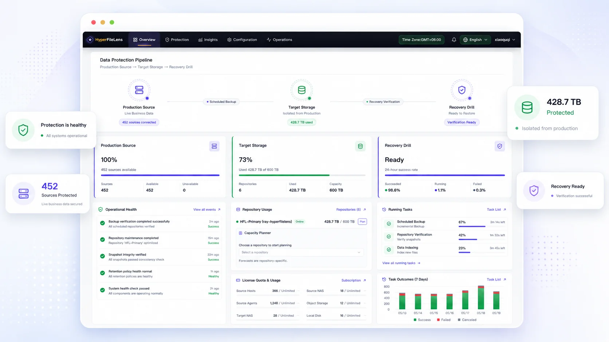
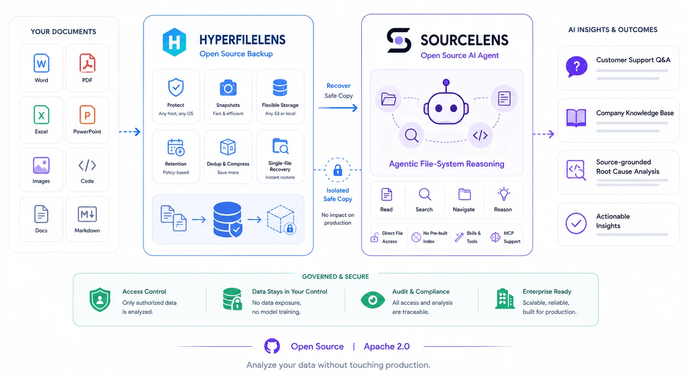
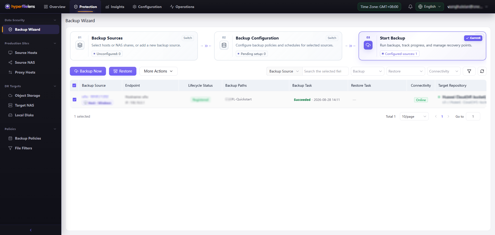
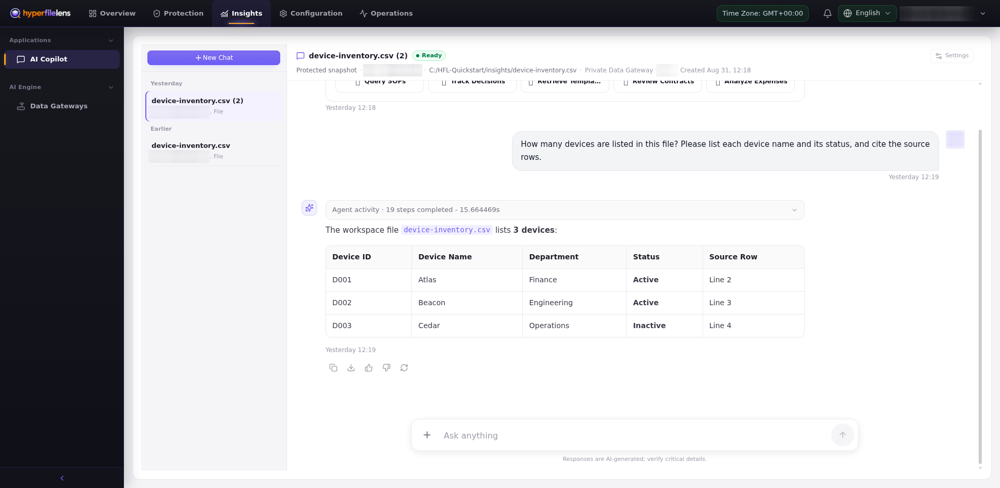

<div align="center">

<picture>
  <source media="(prefers-color-scheme: dark)" srcset="website/public/brand/source/hyperfilelens-lockup-on-dark.png">
  
</picture>

English | [中文](README.zh-CN.md)

**Your backups know more than you think.**

Ask questions straight from your document backups — PDFs, Word, Excel, PowerPoint, images, Markdown,
or any other text format — without touching production.

[Website](https://hyperfilelens.com/) · [Documentation](https://hyperfilelens.com/docs/) · [Try Free](https://app.hyperfilelens.com/) · [Releases](https://github.com/oneprolabs/hyperfilelens/releases) · [@oneprolabs](https://x.com/oneprolabs)

[](LICENSE)
[](#project-status)

</div>

<p align="center">
  
</p>

## Use Cases

The documents that answer most of your questions are already in your backups — specs, policies, support
material, source code. But a backup repository is only searchable by filename, so that knowledge sits
there unused. The obvious fix is to point an AI at the files, and that is exactly what you cannot do:
production hosts should not be opened up to an indexing crawler, and copying everything into yet another
system creates a second place to secure.

HyperFileLens closes that gap. The isolated copy you already keep for recovery becomes the data source
an AI agent reasons over.

**Answers, not just backup search results.**

- **Customer support Q&A** — Answer customer questions straight from your product docs, PDFs, and slide
  decks. Multimodal understanding reads across formats, so nothing needs to be reformatted first.
- **Company knowledge base** — Turn scattered specs, policies, and decisions, engineering or
  company-wide, into one knowledge base every team can actually query, not just search and summarize.
- **Source-grounded root cause analysis** — Not keyword matching, not log scraping. The agent reads and
  reasons through your real source code, the way a senior engineer would, until it can confirm the
  actual root cause.

**Still a rock-solid backup tool.**

- **Any host, plus NAS** — Windows, Linux, and macOS, servers and workstations alike, plus NAS shares,
  all protected under one policy instead of three different tools.
- **No storage lock-in** — Object storage or local storage, any S3-compatible provider. Your backups
  are not tied to one storage vendor.
- **Single-file recovery** — Need one file back right now? Browse any snapshot and restore just that
  file in seconds, with no full-volume restore required.

## How It Works

**Your files stay put. The engine comes to them.**

HyperFileLens backs up your documents and code into a safe, isolated copy — then
[SourceLens](https://github.com/oneprolabs/sourcelens), our open source Agentic RAG engine, reasons
directly over that copy, never touching production. There is no index to build ahead of time: the agent
reads, searches, and navigates the snapshot the way a person would.

<p align="center">
  
</p>

A backup job writes the selected files to target storage and creates a point-in-time snapshot. That same
snapshot can be browsed and restored, or selected as the data source for an Insights session. Insights
only works with data selected from a specific snapshot; it never reads live files from the protected
host.

After a backup completes, the snapshot is browsable and restorable:

<p align="center">
  
</p>

Insights answers questions using the snapshot data selected for the session, and shows the related
sources:

<p align="center">
  
</p>

## Architecture

| Component | Technology | Responsibility |
| --- | --- | --- |
| Console | Vue 3, TypeScript, Vite, Element Plus | Manage backup sources, target storage, backup configurations, jobs, snapshots, restores, and Insights |
| Backend | Python, Django, DRF, Channels, Celery | API, authentication, task scheduling, and orchestration |
| Agent | Go, Kopia | Runs on a backup host, accesses local files, and executes backup and restore jobs |
| Proxy | Go (Agent role) | Connects NAS or local storage so it can be used by backup and restore jobs |
| Data Gateway | Go (Agent role) | Connects to the backup repository and provides selected snapshot data to an Insights session |
| Insights engine | [SourceLens](https://github.com/oneprolabs/sourcelens) | Snapshot data preparation, retrieval, and agentic analysis |
| Gateway | Nginx | HTTPS entry point for the website, consoles, API, and WebSocket connections |
| Data services | PostgreSQL, Redis | Business data, caching, messaging, and asynchronous task state |

By default, the official SaaS provides a Public Data Gateway, and Community deploys one during
installation. Deploy a Private Data Gateway when the Public Data Gateway cannot reach the backup
repository, or when data processing must remain in a network you manage.

### Repository Layout

```text
hyperfilelens/
├── deploy/              Runtime, Nginx, bootstrap, and installer assets
├── dev/                 Local development entry points
├── release/             Offline release build entry points
├── src/
│   ├── agent/           Go Agent source and packaging templates
│   ├── backend/         Django backend source
│   └── frontend/        Vue frontend source
├── tools/               Build, dependency, quality, and publishing tools
├── website/             Product website and bilingual user documentation
├── .env.example         Environment configuration template
└── docker-compose.yml   Local development service orchestration
```

## Quick Start

### Install Community

Community runs on an Ubuntu host that you manage:

- Ubuntu 20.04, 22.04, or 24.04 on amd64.
- At least 4 CPU cores, 8 GiB of memory, and 20 GiB free on the disk containing `/opt`. For regular
  use, 8 CPU cores and 16 GiB of memory are recommended.
- Docker Engine 24.0.0+ and Docker Compose V2 2.20.0+, with the Docker daemon running. The installer
  can install Docker CE and Compose V2 when Docker is absent, and always reuses a healthy existing
  Docker CE runtime.
- `curl`, Python 3, `sudo` access, and network access to GitHub, the container registry, and the
  Ubuntu package repositories.

Run this on the prepared host:

```bash
curl -fsSL https://raw.githubusercontent.com/oneprolabs/hyperfilelens/main/deploy/online/install.sh \
  | sudo bash -s -- --mirror global
```

When installation finishes, open the complete address marked `Tenant` in the installation result to
enter the console. See [Install Community](https://hyperfilelens.com/docs/getting-started/install) for
detailed system requirements, network conditions, Docker runtime rules, and installation checks.

### Use the Official SaaS

The official HyperFileLens SaaS is provided and operated by OnePro Cloud, with no control plane to
install or maintain. Open the [SaaS console](https://app.hyperfilelens.com/) to start. You still install
an Agent on the host whose files you want to protect, and prepare object storage that both the SaaS and
the backup host can reach.

### Complete Your First Workflow

Either way, the [first-use guide](https://hyperfilelens.com/docs/) walks a set of test files through the
complete path: [sign in](https://hyperfilelens.com/docs/getting-started/sign-in) →
[add a backup source](https://hyperfilelens.com/docs/getting-started/add-source) →
[configure it](https://hyperfilelens.com/docs/getting-started/configure-source) →
[add target storage](https://hyperfilelens.com/docs/getting-started/add-target) →
[run the first backup](https://hyperfilelens.com/docs/getting-started/first-backup) →
[check the snapshot](https://hyperfilelens.com/docs/getting-started/verify-backup) →
[restore a file](https://hyperfilelens.com/docs/getting-started/first-restore) →
[create an Insights session](https://hyperfilelens.com/docs/getting-started/first-insight).

### Supported Environments

| | Supported |
| --- | --- |
| Backup hosts | Linux amd64/arm64, macOS amd64/arm64, Windows amd64 |
| Target storage | Amazon S3, Alibaba Cloud OSS, Huawei Cloud OBS, S3-compatible object storage, NAS or local storage through a Proxy |
| Community control plane | Ubuntu 20.04/22.04/24.04 amd64, Docker Engine 24.0.0+, Docker Compose V2 2.20.0+ |

See [Supported Configurations](https://hyperfilelens.com/docs/reference/support-matrix) and
[Limitations and Security Recommendations](https://hyperfilelens.com/docs/reference/limitations-security)
for product boundaries.

### Running It Safely

- Change the initial password immediately after installing Community.
- Protect `.env`, access credentials, TLS private keys, backup data, and runtime logs.
- Expose product and component ports only to the networks that need them; do not publish administrative
  entry points directly to the internet.
- Use access credentials and least-privilege policies for object storage; the bucket does not need to
  be public.

## Development

The development environment is a hot-reload Docker Compose stack. Run this from the repository root:

```bash
./dev/stack.sh up
```

The first start prepares dependencies, builds Agent packages, and starts the backend, frontend,
database, cache, gateway, and Insights services. It may take several minutes.

| Service | URL |
| --- | --- |
| Product website | `https://localhost:11442/` |
| Tenant console | `https://localhost:11443/` |
| Platform Operations console | `https://localhost:11444/` |
| Insights console | `https://localhost:11445/` |
| OpenAPI | `https://localhost:11443/swagger` |

```bash
./dev/stack.sh status
./dev/stack.sh restart
./dev/stack.sh doctor
./dev/stack.sh smoke
./dev/stack.sh down
```

Run the checks that match the files you changed:

```bash
# Backend
docker compose exec worker python manage.py test

# Frontend
docker compose exec web npm run lint
docker compose exec web npm run test
docker compose exec web npm run build

# Agent
cd src/agent && go test ./...

# Repository checks, before opening a pull request
python3 tools/quality/check-english-source.py
python3 -m unittest tools/quality/test_check_english_source.py
./tools/quality/check-release-contracts.sh
```

For additional development and build options, run the relevant repository scripts with `--help`.

## Repository Maintenance and Orphan Snapshots

Full Maintenance uses persistent, balanced two-day calendar assignments in the
Controller server's local 01:00–05:00 window. Automatic retries obey that window;
work already running at 05:00 can finish. The installer and development startup
persist the host IANA timezone as `STORAGE_MAINTENANCE_TIMEZONE`. Quick Maintenance
remains on a six-hour interval. Existing custom maintenance configuration is
preserved; previous shipped daily defaults are migrated to two days.

Orphan reconciliation runs every two days, including owned repositories with no
remaining backup sources. In a repository's Tasks tab, **Reconcile orphan
snapshots** starts a manual scan. First discovery only marks the snapshot. A later
scan may delete it after a 24-hour discovery grace period and a fresh safety
check. Discovery and successful deletion are separate audit entries containing
the backup source, directory, and full snapshot ID. Actual storage reclamation
still requires subsequent maintenance and Kopia's normal safety delays.
For an observation-only rollout, set
`STORAGE_ORPHAN_SNAPSHOT_DELETE_ENABLED=false`; discovery continues, but deletion
is deferred until an operator enables it.

Active backups, pending result registration, snapshot usage, uncertain Agent
termination, and unverified ownership prevent automatic deletion. An interrupted
deletion retains a persistent repository gate rather than assuming that a lease
expiry proves process termination. Confirm the original execution has stopped
and reconcile its result before releasing such a gate. Node-owned repositories
require Agents advertising `orphan_snapshot_reconcile_v1`; older Agents fail
closed without deleting snapshots.

## Repository Health Monitoring

Daily health monitoring defaults to `lightweight` for object storage, NAS and
local-disk repositories. It reads only `kopia.repository` and
`.hyperfilelens/repository-owner-v1.json`, validates their basic structure and
expected ownership, and never opens Kopia, loads indexes, adopts ownership or
writes repository objects. Object storage is checked by the Controller;
filesystem repositories retain their existing execution nodes and locations.
On NAS and local disks, the logical `kopia.repository` blob is physically
stored as `kopia.repository.f` by Kopia's filesystem provider. The ownership
marker path is the same for all storage types.
Online status confirms metadata accessibility and ownership, not full data
integrity, the repository password or write/delete permissions.

Configure the deployment `.env` and restart the backend services to apply:

```dotenv
STORAGE_REPOSITORY_HEALTH_CHECK_MODE=lightweight
STORAGE_REPOSITORY_HEALTH_LIGHTWEIGHT_TIMEOUT_SECONDS=60
STORAGE_REPOSITORY_HEALTH_LEGACY_TIMEOUT_SECONDS=900
```

Set the mode to `legacy` to retain the previous Kopia-based probe. Each timeout
is an execution budget per repository location, shared across stages and
excluding queue time. Health budgets do not change backup, restore, usage
collection or maintenance timeouts. Existing status decisions, retries and
notifications remain unchanged.

Lightweight filesystem checks require Agents advertising
`repository_lightweight_health_v1`. Upgrade those Agents before rollout, or
explicitly select `legacy`. Unsupported Agents do not silently fall back to
Kopia and do not provide a confirmed storage-failure result. Legacy Agents
retain their own built-in command limits; the extended Agent-side legacy
budget requires an updated Agent.

## Contributing

Pull requests and issues are both welcome. Found a bug, hit a rough edge, or want a capability that is
not there yet? [Open an issue](https://github.com/oneprolabs/hyperfilelens/issues) — that is the fastest
way to reach us.

Before opening a pull request:

1. Create a focused development branch from the current default branch.
2. Keep source code, comments, commits, and pull requests in English.
3. Add or update tests for behavior changes.
4. Run the quality checks and builds relevant to your changes.
5. Describe the problem, solution, and validation in the pull request.

## Community

Follow [@oneprolabs on X](https://x.com/oneprolabs) for release notes, development updates, and what we
are building next. Chinese-speaking users can find the WeChat group QR code in the
[Chinese README](README.zh-CN.md).

## Documentation

- [Quick Start](https://hyperfilelens.com/docs/)
- [Product Usage](https://hyperfilelens.com/docs/product/)
- [Backup and Restore](https://hyperfilelens.com/docs/backup-restore/)
- [Insights](https://hyperfilelens.com/docs/insights/)
- [Deployment and Operations](https://hyperfilelens.com/docs/deployment/)
- [Help Center](https://hyperfilelens.com/docs/help/)

## Project Status

HyperFileLens is currently in public beta. Interfaces, configuration, and release packaging may change
before the first stable release.

## License

HyperFileLens Community is licensed under the [Apache License 2.0](LICENSE).
